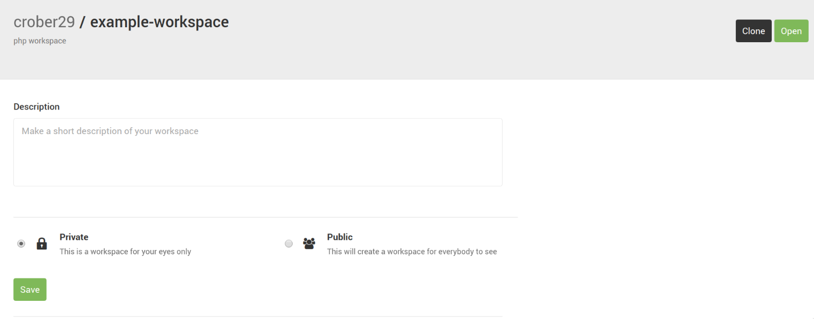

#Submission Guidelines

[Git Reference](https://learnxinyminutes.com/docs/git/)

[Git Tutorial](https://try.github.io/levels/1/challenges/1)

We will be submitting all labs and assignments henceforth
in the manner described.  Please make note and ask
questions to ensure proper submission!

Create a PRIVATE Cloud9 workspace with the php stack.


If you have already created a workspace with a php stack and it is public, you can edit the settings by clicking on the gear icon.


Then select private.  Click save.



##Share Your Workspace

Ensure the workspace has been shared with
dphayes (instructor) and crober29 (ta).

Share is under Window in the top menu


##Cloning a Lab/Project Repository

* Open a terminal if one is not already open
* Clone lab template repository

`git clone https://github.com/it202/example.git`


Notice the new folder in your workspace.

This new folder will contain all the files in the remote repository and all files created/related to this assignment should be contained within.

## Submission

When you are ready to submit `cd` into the folder that you cloned. `git status` will show currently staged files. Green is staged, red is unstaged.


To stage all files to be committed use `git add` with the all flag `-A`.

```
cd example_folder
git add -A
git commit -m "submission description"
```


Use `git log` to check if your latest commit was successful.


We will `git checkout` the last commit in the repository that is time-stamped before or on the deadline. Any changes after the deadline will be considered late.

### Notes

* You can stage some files but not others, I personally use the `git add -i` command to do this.
* The system date of your workspace might be off, we will take note of this with `date` (there is also file revision history :smile:).
* There is no need to push your repository since your workspace should be shared.
